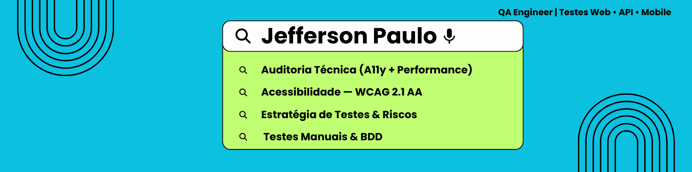

# Portfólio de QA – Akross



Portfólio de Qualidade com planejamento, execução e comunicação clara de resultados para a solução Akross. Inclui evidências em vídeo/GIF, matriz de risco e auditoria com recomendações práticas.

## Índice
- [Visão Geral](#visão-geral)
- [Destaques](#destaques)
- [Entregáveis](#entregáveis)
- [Demonstração](#demonstração)
- [Guia Rápido](#guia-rápido)
- [Metodologia e Critérios](#metodologia-e-critérios)
- [Ferramentas](#ferramentas)
- [Estrutura](#estrutura)
- [Contato](#contato)

## Visão Geral
- Objetivo: aplicar práticas de QA ao produto Akross cobrindo risco, acessibilidade e conformidade.
+- Papel: QA responsável pelo planejamento, execução, evidências e síntese executiva.
+- Escopo: testes funcionais, análise de risco, checklist de acessibilidade e auditoria.
+- Público: times de produto/engenharia e stakeholders que precisam de visibilidade de qualidade.

## Destaques
- Fluxo crítico validado e registrado em vídeo e GIF (15s, 12 fps, 1280px).
- Matriz de riscos priorizada para decisões rápidas.
- Auditoria com achados, severidade e recomendações objetivas.
- Checklist manual de acessibilidade (WCAG) com apontamentos e próximas ações.

## Entregáveis
- **Plano e Estratégia de Testes**: `Plano_e_Estrategia_de_Testes_Adaptada_Akoss.docx`
- **Foco Corporativo** (briefing/objetivos): `Foco_Corporativo_Akoss.docx`
- **Estudo de Acessibilidade Manual**: `estudo-acessibilidade-manual.docx`
- **Relatório de Auditoria**: `Relatario_de_Auditoria_Akoss.docx`
- **Tabela de Riscos**: `Tabela_de_Riscos_Akross.xlsx`
- **Evidência em vídeo (compacta)**: `evidencia_mAFP0cta.mp4` (base do GIF)
- **Evidência em vídeo (completa)**: `Evidência.mp4`
- **GIF da demonstração**: `docs/preview.gif`

## Demonstração


> GIF gerado a partir de `evidencia_mAFP0cta.mp4`, cobrindo login, navegação e verificações críticas de acessibilidade.

## Guia Rápido
1) Assista `evidencia_mAFP0cta.mp4` (ou `Evidência.mp4` para o fluxo completo).  
2) Leia `Plano_e_Estrategia_de_Testes_Adaptada_Akoss.docx` para escopo e critérios de aceite.  
3) Revise `Tabela_de_Riscos_Akross.xlsx` para a priorização aplicada.  
4) Consulte `Relatario_de_Auditoria_Akoss.docx` e `estudo-acessibilidade-manual.docx` para achados e recomendações.  
5) Use `docs/preview.gif` para uma visão rápida do fluxo validado.

## Metodologia e Critérios
- Baseado em risco: foco em fluxos críticos e alto impacto.
- Acessibilidade: checklist manual (WCAG) com contraste, navegação por teclado e rótulos.
- Evidências: gravação contínua, GIF otimizado e versionado.
- Comunicação: achados com severidade + recomendação acionável por entregável.

## Ferramentas
- Documentação: Word, Excel.
- Evidências: ffmpeg portátil (`tools/ffmpeg`) e ScreenToGif.
- Versionamento: GitHub.

## Estrutura
```
portfolio-qa-akross/
├─ docs/                  # assets públicos (preview.gif)
├─ tools/ffmpeg/          # ffmpeg portátil para refazer o GIF
├─ evidencia_mAFP0cta.mp4 # vídeo compacto (base do GIF)
├─ Evidência.mp4          # vídeo completo
├─ banner-qa-jefferson-paulo.png
├─ Plano_e_Estrategia_de_Testes_Adaptada_Akoss.docx
├─ Foco_Corporativo_Akoss.docx
├─ estudo-acessibilidade-manual.docx
├─ Relatario_de_Auditoria_Akoss.docx
└─ Tabela_de_Riscos_Akross.xlsx
```

## Contato
- Jefferson Paulo — [LinkedIn](https://www.linkedin.com/) | jefferson.paulo@email.com
